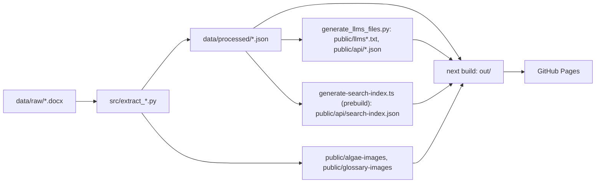

# Kinneret Algae Atlas

This site is the **algae atlas of Dr. Tamar Zohary**—a lifelong research effort documenting the algae of **Lake Kinneret** (the Sea of Galilee). The atlas brings together scientific descriptions, imagery, and ecology drawn from that work into a public, browsable catalog. The authors write in Word; this repository turns those `.docx` files into structured JSON and images (Python) and publishes them as a static Next.js site on GitHub Pages.

**Live site:** [https://kinneret-algae-atlas.org/](https://kinneret-algae-atlas.org/)

## Pipeline



Word files are the source of truth; every JSON, image and discovery file downstream is regenerated, committed, and checked for drift in CI (Continuous Integration). Step-by-step update procedure: [docs/MAINTENANCE.md](docs/MAINTENANCE.md). Draft plans and review specs: [ideas/](ideas/).

## Setup

Node 20 (`.nvmrc`; `package.json` requires `>=20.9`) and Python 3.12 (`pyproject.toml` requires `>=3.12`).

```bash
npm ci
python3.12 -m venv .venv && source .venv/bin/activate && pip install -r requirements.txt -r requirements-dev.txt
```

`requirements.txt` pins the extractor runtime (python-docx, Pillow, lxml; pywin32 on Windows only); `requirements-dev.txt` adds ruff. Keep the venv activated: the `python` scripts in `package.json` use whatever `python` is on `PATH`.

## Scripts

| Script | What it does | When to run |
| --- | --- | --- |
| `npm run dev` | Next.js dev server | Local preview |
| `npm run build` | `next build` static export to `out/` | Before `test:export`; CI runs it |
| `npm run prebuild` | Runs `generate:search-index` | Auto-run by npm before every `build`; never call directly |
| `npm run start` | Serves a production build | Rarely; the site is a static export |
| `npm run lint` | `tsc --noEmit` type check | Before pushing; CI |
| `npm run test` | Vitest suite (`tests/*.test.ts`); skips the export check unless `out/` exists | Before pushing; CI |
| `npm run test:export` | Link and asset check over `out/` (`EXPORT_CHECK=1`, fails if `out/` is missing) | After `npm run build`; CI |
| `npm run test:py` | Python stdlib `unittest` suite (`tests/test_*.py`) with `PYTHONPATH=src` | After extractor changes; CI |
| `npm run validate:data` | `scripts/validate-algae-data.ts`: schema-checks algae and glossary JSON | After any extraction; CI |
| `npm run extract:algae` | `src/extract_algae.py` over all taxon `.docx` (`--use-word-renderer`) | Taxon Word file or extractor changed |
| `npm run extract:supplements` | `src/extract_supplements.py` | `*suppl*.docx` changed, or after an image rebuild |
| `npm run extract:glossary` | `src/extract_glossary.py` | `*glossary*.docx` changed |
| `npm run extract:about` | `src/extract_about.py` | `*about*.docx` changed |
| `npm run generate:llms` | `scripts/generate_llms_files.py`: `public/llms.txt`, `public/llms-full.txt`, `public/api/{species,glossary,atlas}.json`, `public/api/species/*.json` | After any algae or glossary data change; CI checks drift |
| `npm run generate:search-index` | `scripts/generate-search-index.ts`: `public/api/search-index.json` | Via `prebuild`; CI checks drift |
| `npm run build:atlas` | `validate:data` + `generate:search-index` + `next build` | Full local rebuild |
| `npm run sync:atlas` | All four extractors, `generate:llms`, then `build:atlas` | Full refresh from Word (commit and push yourself) |
| `python scripts/optimize-hero-image.py` | Manual tool: resizes a hero photo to `<input>.optimized.{webp,jpg}` (`--input`, `--output`, `--max-px`) | Only when the home hero photo changes; inspect, then move the outputs over `public/kinneret-lake.*` yourself |

Every `src/extract_*.py` entry point takes `--input` (repeatable for algae and supplements; omit it to auto-discover under `data/raw/`, or `--raw-dir`), `--output`, and, where images are extracted, `--images-dir` and `--images-public-prefix`. Run `python src/<script>.py --help` for the full list. Lint Python with `ruff check src scripts tests`.

## Routes

| Route | What it shows | Owning file |
| --- | --- | --- |
| `/` | Hero, species index with a "By phylum \| By morphotype" switch, study area, recently updated | `app/page.tsx`; index in `app/components/AlgaeIndexSection.tsx` |
| `/#visual-index` | Opens the morphotype view: thumbnail grid with a clickable phylum legend | `app/components/VisualIndexGrid.tsx` (embedded by `AlgaeIndexSection`) |
| `/algae/[slug]/` | One species record | `app/algae/[slug]/page.tsx` |
| `/supplements/` | Supplementary material grouped by phylum | `app/supplements/page.tsx` |
| `/supplements/[slug]/` | One supplement | `app/supplements/[slug]/page.tsx` |
| `/glossary/` | Cox (1996) reference plates, then A–Z term sections | `app/glossary/page.tsx`, `app/components/GlossaryPageClient.tsx` |
| `/about/` | About page from `data/processed/about.json` | `app/about/page.tsx` |
| `/algae` | Redirect to `/` (keeps `?q=`) | `app/algae/AlgaeLegacyRedirect.tsx` |
| `/visual-index/` | Redirect to `/#visual-index` | `app/visual-index/VisualIndexRedirect.tsx` |
| `/sitemap.xml`, `/robots.txt` | Generated at build | `app/sitemap.ts`, `app/robots.ts` |
| `/llms.txt`, `/llms-full.txt`, `/api/*.json` | Machine-readable index and static API | Committed under `public/`, see Scripts |

The sticky header shared by every page is `app/components/SiteHeader.tsx`. Redirects are client-side because a static export has no server.

## Deploy

Pushing to `main` runs `.github/workflows/deploy-pages.yml`, which calls the reusable `checks.yml` (pip install incl. dev, ruff, `npm ci`, `test:py`, `validate:data`, `lint`, `test`, a generated-files drift check that reruns `generate:search-index` and `generate:llms` and fails on `git diff`, `build`, `test:export`), uploads `out/` as the Pages artifact and deploys it. `ci.yml` calls the same `checks.yml` on every push and pull request without deploying.

- `NEXT_PUBLIC_GOATCOUNTER_CODE` (repo Actions variable): enables the GoatCounter visit counter in `app/layout.tsx`; unset means no analytics script.
- `NEXT_PUBLIC_BASE_PATH`: set to `/repo-name` at build time to host under a sub-path (`next.config.ts`, `lib/public-path.ts`). Unset for the domain root, which is how the live site is built.
- `public/CNAME` holds `kinneret-algae-atlas.org` so Pages serves the custom domain; `public/.nojekyll` stops Pages from running Jekyll over the export.

## Conventions

Restated from `.cursor/rules/*.mdc`:

1. **Word is the source of truth.** Never edit files under `data/raw/`. Report source typos or wrong units to the authors instead of patching extracted JSON to hide them.
2. **Never hand-edit processed JSON.** Fix `src/algae_extractor/`, `src/extract_*.py`, or the `.docx`, then re-run extraction in the same change. Hand edits are only for quick local experiments and must be folded back into the extractor.
3. **Preview before merge.** A PR with a user-visible change stays draft until the user has seen it running (`npm run dev`, screenshots or a short recording); production updates only after merge to `main`. Extractor-only, test-only, or JSON-only changes need no preview.

## Copyright

© All rights reserved. The scientific knowledge in this atlas is that of **Dr. Tamar Zohary** and **Dr. Alla Alster**.
