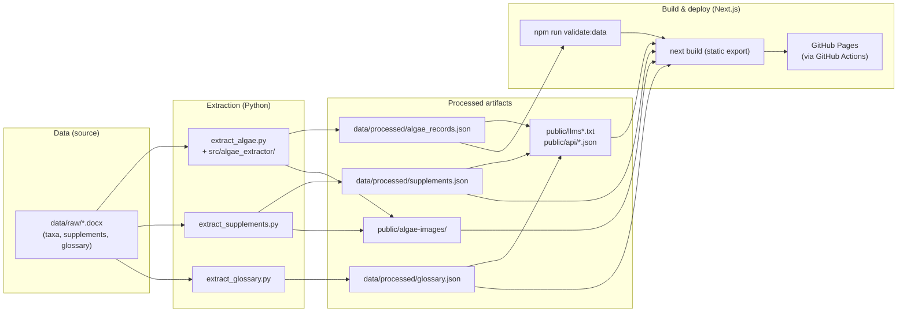

# Maintaining the Kinneret Algae Atlas

This document is for maintainers. It covers how to update the published atlas when the
source Word files change, and how the data pipeline fits together.

## Pipeline overview



## Updating the atlas from a new Word file

When `data/raw/` gets an updated `.docx`, run these steps in order (from the repository root).

1. **Add or replace the file** under `data/raw/` (keep a clear filename, e.g. `1 Dinoflagellates workfile for Gal YYYY-MM-DD.docx`).

2. **Optional:** If the canonical filename changed, update defaults so ad-hoc runs stay correct:
   - `src/extract_algae.py` (`--input` default)
   - `package.json` (`sync:atlas` script)

3. **Extract JSON and images** (always run after changing the Word source or the Python extractor):

   ```bash
   python src/extract_algae.py --input "data/raw/<your-file>.docx" --output "data/processed/algae_records.json" --images-dir public/algae-images --use-word-renderer
   ```

   Or, if defaults already point at the right file:

   ```bash
   python src/extract_algae.py --use-word-renderer
   ```

   For multi-doc builds, repeat `--input` (one per file), or omit `--input` to auto-discover all
   `data/raw/*.docx` files except names matching `*suppl*.docx` or `*glossary*.docx` (supplements
   and the glossary have their own extractors below).

   Re-running extraction **prunes** each species image folder: files not listed in the new
   JSON are deleted (so replaced or removed pictures in Word do not leave stale files on disk).

4. **Validate processed data** (matches CI):

   ```bash
   npm run validate:data
   ```

5. **Tests** (optional locally; required on push via GitHub Actions):
   - Node: `npm run test`
   - Python: `PYTHONPATH=src python -m unittest discover -s tests -p "test_*.py" -v`
     (PowerShell: `$env:PYTHONPATH='src'; python -m unittest discover -s tests -p "test_*.py" -v`)

6. **Supplements** (when `data/raw/9-Suppl1*.docx` changes, or after a full image rebuild):

   ```bash
   python src/extract_supplements.py
   ```

   With no `--input`, all `data/raw/*suppl*.docx` and `*supplement*.docx` files are auto-discovered.
   Pass `--input` repeatedly to force one or more specific supplement files.

   > **Important:** `extract_algae.py` does not touch supplement images. If you delete `public/algae-images/` and re-extract, you must re-run this step or supplement figures will be missing.

7. **Glossary** (when the `data/raw/*glossary*.docx` file changes):

   ```bash
   python src/extract_glossary.py
   ```

   With no `--input`, the newest `data/raw/*glossary*.docx` is auto-discovered (date-stamped
   names sort newest-last). Pass `--input` to force a specific file. Legacy `.doc` glossary
   files are no longer supported; save glossary updates as `.docx`.

8. **About** (when `data/raw/*about*.docx` changes):

   ```bash
   python src/extract_about.py
   ```

   With no `--input`, the newest `data/raw/*about*.docx` is auto-discovered.
   About files are excluded from algae extraction by default (`*about*.docx`).

9. **LLM/static API files** (after any atlas, supplement, glossary, or about data change):

   ```bash
   npm run generate:llms
   ```

   This regenerates `public/llms.txt`, `public/llms-full.txt`, and static JSON under
   `public/api/` for LLM and machine-readable access.

10. **Local preview:** `npm run dev`

11. **Publish:** Commit the updated `data/processed/algae_records.json`, `data/processed/glossary.json`, `data/processed/supplements.json`, `data/processed/about.json`, `public/algae-images/`, `public/glossary-images/`, `public/api/`, `public/llms*.txt`, and any `src/` or config changes, then push to **`main`**. GitHub Actions builds and deploys GitHub Pages when the workflow passes.

**One-shot extract + validate + production build** (still commit and push yourself):

```bash
npm run sync:atlas
```

`sync:atlas` now runs algae extraction, supplement extraction, glossary extraction, About extraction, LLM/static
API generation, validation, and a production build.

Structural or recurring extraction bugs belong in `src/algae_extractor/` (and re-run step 3) — not in hand-edits to `algae_records.json` that the next extract would overwrite.
