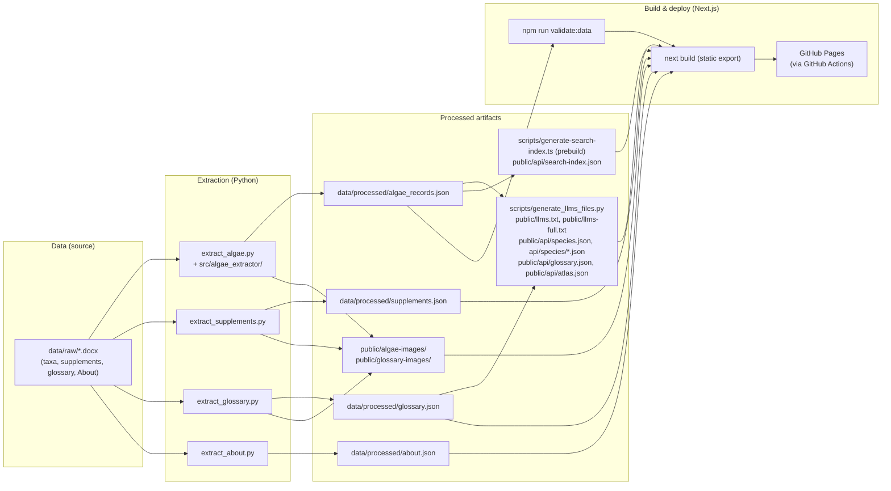

# Maintaining the Kinneret Algae Atlas

This document is for maintainers. It covers how to update the published atlas when the
source Word files change, and how the data pipeline fits together. Local setup, npm
scripts, routes, and GitHub Pages deploy: [DEVELOPMENT.md](DEVELOPMENT.md).

## Pipeline overview



`npm run generate:llms` builds `public/llms*.txt` and the static API JSON under `public/api/` from **algae + glossary** JSON (plus `data/study-area.json` for `atlas.json`). `public/api/search-index.json` is not one of its outputs: `scripts/generate-search-index.ts` writes it, and npm runs that script automatically as `prebuild` before every `npm run build`. Supplement and About pages are linked from `llms.txt` as site URLs; they are not yet emitted as separate API JSON files.

## Updating the atlas from a new Word file

When `data/raw/` gets an updated `.docx`, run these steps in order (from the repository root).

1. **Add or replace the file** under `data/raw/` (keep a clear filename, e.g. `1 Dinoflagellates YYYY-MM-DD.docx`).
   - Taxon docs: any `*.docx` that is not a supplement, glossary, or About file.
   - Supplements: `*suppl*.docx` / `*supplement*.docx`
   - Glossary: `*glossary*.docx`
   - About: `*about*.docx`

2. **Extract algae JSON and images** (always run after changing a taxon Word source or the Python extractor):

   Prefer auto-discovery of **all** taxon files (no `--input`):

   ```bash
   python src/extract_algae.py --output "data/processed/algae_records.json" --images-dir public/algae-images --use-word-renderer
   ```

   Omitting `--input` scans `data/raw/*.docx` and skips filenames matching `*suppl*.docx`, `*glossary*.docx`, and `*about*.docx` (those have their own extractors below).

   For a single-file debug run, pass one or more paths:

   ```bash
   python src/extract_algae.py --input "data/raw/<your-file>.docx" --output "data/processed/algae_records.json" --images-dir public/algae-images --use-word-renderer
   ```

   `--use-word-renderer` needs Microsoft Word on Windows (better chart export). CI and Linux use the Pillow fallback. The Word-renderer path is only validated locally on Windows; no automated test or CI job exercises it.

   Re-running extraction **prunes** each species image folder: files not listed in the new
   JSON are deleted (so replaced or removed pictures in Word do not leave stale files on disk).

   Extracted images are optimized for the web on save (`src/algae_extractor/image_optimize.py`):
   photos/plates and thumbnails are downscaled and re-encoded as progressive JPEG, while
   charts (`figure-*`) stay PNG so axis text stays crisp. This keeps the shipped image payload
   small for mobile; no manual compression step is needed.

   You do **not** need to edit `package.json` or extractor defaults when a Word filename changes — discovery is by glob under `data/raw/`.

3. **Validate processed data** (matches CI; algae + glossary today):

   ```bash
   npm run validate:data
   ```

4. **Tests** (optional locally; all of them run on push via GitHub Actions):
   - `npm run lint` — TypeScript type check (`tsc --noEmit`).
   - `npm run test` — Vitest suite. It skips the export link check unless `out/` exists, so it never needs a build.
   - `npm run test:py` — Python suite, stdlib `unittest` (no pytest); the script sets `PYTHONPATH=src`, so only the venv needs to be activated.
   - `npm run test:export` — link and asset check over `out/`; run it after `npm run build` (a missing `out/` fails here instead of skipping).

5. **Supplements** (when `data/raw/*suppl*.docx` / `*supplement*.docx` changes, or after a full image rebuild):

   ```bash
   python src/extract_supplements.py
   ```

   With no `--input`, all matching supplement files under `data/raw/` are auto-discovered.
   Pass `--input` repeatedly to force one or more specific supplement files.

   > **Important:** `extract_algae.py` does not touch supplement images. If you delete `public/algae-images/` and re-extract, you must re-run this step or supplement figures will be missing.

6. **Glossary** (when `data/raw/*glossary*.docx` changes):

   ```bash
   python src/extract_glossary.py
   ```

   With no `--input`, the newest `data/raw/*glossary*.docx` is auto-discovered (date-stamped
   names sort newest-last). Pass `--input` to force a specific file. Legacy `.doc` glossary
   files are no longer supported; save glossary updates as `.docx`.

7. **About** (when `data/raw/*about*.docx` changes):

   ```bash
   python src/extract_about.py
   ```

   With no `--input`, the newest `data/raw/*about*.docx` is auto-discovered.
   About files are excluded from algae extraction by default (`*about*.docx`).

8. **LLM/static API files** (after any algae or glossary data change; also refresh after publish so discovery files stay current):

   ```bash
   npm run generate:llms
   ```

   This regenerates `public/llms.txt`, `public/llms-full.txt`, and static JSON under
   `public/api/` (species index, per-species JSON, glossary JSON, `atlas.json`).

9. **Local preview:** `npm run dev`

10. **Publish:** Commit the updated `data/processed/algae_records.json`, `data/processed/glossary.json`, `data/processed/supplements.json`, `data/processed/about.json`, `public/algae-images/`, `public/glossary-images/`, `public/api/`, `public/llms*.txt`, and any `src/` or config changes, then push to **`main`**. GitHub Actions builds and deploys GitHub Pages when the workflow passes.

**One-shot extract + validate + production build** (still commit and push yourself):

```bash
npm run sync:atlas
```

`sync:atlas` runs algae extraction (auto-discover all taxon docs + `--use-word-renderer`), then supplements, glossary, About, LLM/static API generation, validation, and a production build. It does not hardcode individual Word filenames.

Structural or recurring extraction bugs belong in `src/algae_extractor/` (and re-run step 2) — not in hand-edits to `algae_records.json` that the next extract would overwrite.

## Visit analytics (GoatCounter)

The layout emits an anonymous, cookie-free [GoatCounter](https://www.goatcounter.com/)
counter **only** when the production build gets a site code. To enable it once:

1. Create a free GoatCounter account and pick a site code (e.g. `kinneret-algae-atlas`).
2. In the GitHub repo: Settings → Secrets and variables → Actions → **Variables** →
   add `NEXT_PUBLIC_GOATCOUNTER_CODE` with that code.

The next deploy starts counting. Local `npm run dev` and builds without the variable
ship no analytics script at all.

The site is a static export with client-side navigation, so the stock script would count
only the first page of each visit. `app/components/VisitCounter.tsx` reports every later
route change as well. This was added on 2026-09-08; per-page numbers before that date are
landing pages only and are not comparable with later ones.
